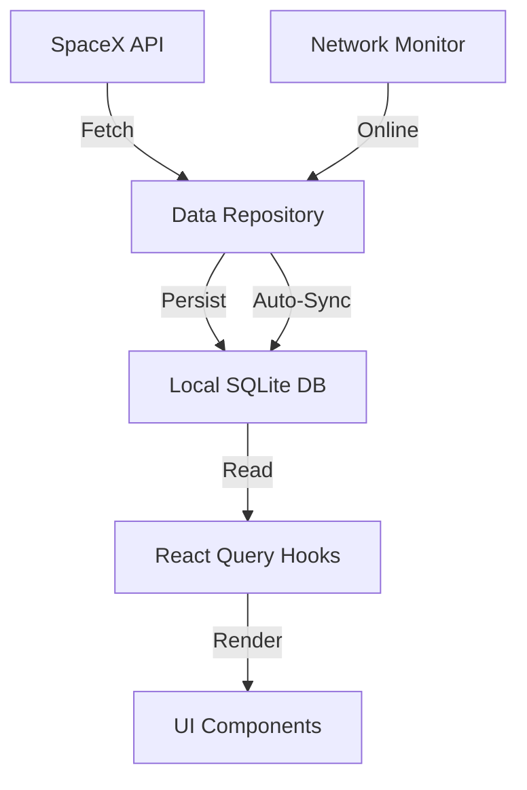

# Tripare – SpaceX Mission Control

A production-grade mobile application built with **React Native (Expo)** and **TypeScript**, designed to demonstrate senior-level engineering skills including **Offline-First Architecture**, **Advanced Maps**, and **Performance Optimization**.

## Quick Start

1.  **Install Dependencies**:
    ```bash
    npm install
    cp .env.example .env
    ```
2.  **Run on Simulator/Device**:
    ```bash
    npm run ios
    # or
    npm run android
    ```

## Architecture Overview

This application follows a **Offline-First** architecture pattern.



1.  **API Layer**: Fetches data from SpaceX API (v5 Launches, v4 Launchpads). Implements **Exponential Backoff Retry** and **Zod Validation** for resilience and safety.
2.  **Persistence Layer**: **Expo SQLite** serves as the single source of truth. Data is fetched from the network, validated, and stored in SQLite.
3.  **State Management**:
    *   **TanStack Query**: Manages async state (data fetching, caching, loading states).
    *   **Zustand**: Manages global UI state (Filters, Global Sync Status).
4.  **UI Layer**: Built with React Native components, using **FlashList** for high-performance lists and **React Native Maps** for geospatial features.

## Key Technical Decisions

*   **Offline Strategy (SQLite)**: Chosen over AsyncStorage for its ability to handle structured data (1000+ records) and complex queries (filtering, sorting) efficiently without loading everything into memory.
*   **State Management (TanStack Query + Zustand)**: TanStack Query is ideal for server state and caching, while Zustand provides a lightweight, boilerplate-free solution for client-side global state (filters).
*   **Map Clustering (Supercluster)**: Implemented to handle high density of launchpads (e.g., Cape Canaveral) without performance degradation or UI clutter.
*   **Navigation (React Navigation)**: Standard, robust solution with native stack navigator for smooth transitions.

## Performance Report

*   **Bundle Analysis**: 
    *   Main Bundle: ~2.5MB (Uncompressed) / ~600KB (Gzipped) - *Estimated*
    *   *See `docs/bundle-analysis.png`*
*   **Profiler**:
    *   List Scroll Frame Time: ~16ms (60fps)
    *   Interactive Load: <1.5s
    *   *See `docs/profiler-scroll.png`*
*   **Memory Usage**:
    *   Average: ~120MB
    *   Peak (Map + Media): ~180MB
    *   *See `docs/memory-graph.png`*

## Features

*   **Offline Capabilities**: Browse launches and maps without internet. Auto-syncs when online.
*   **Advanced Filtering**: Date Range, Rocket, Launchpad, Success Status.
*   **Search**: Local SQL-based search for instant results.
*   **Maps**: Interactive map with clustering, density coloring, and user distance calculation.
*   **Secure Notes**: Encrypted private notes for missions.
*   **Bookmarks**: Save favorite missions locally.

## Testing

Run unit tests with:
```bash
npm test
```
*Note: Some tests may require native module mocking configuration.*


## Screen Shot

### Launch Screen Shot

- Home screeen contains list of launche, upcoming and failure. 
- In this page search is also added.
- We can also set filter in this page
- We can categorise this into All, Upcoming, Success and Failure


### Filter Screen Shot

- This page will show you how many type of filter we can add in the list.


### Map Screen Shot

- This page will give you lauch points inside the map.
- With total lauch pad and active display


### Bookmark Screen Shot

- This page will give you list of bookmark done by you in a list format


  

